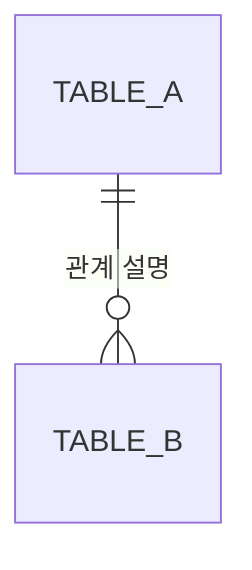

# 논리 스키마: [서비스 이름]

> 이 문서는 개념 데이터 모델이 **실제로 어떤 테이블·컬럼·열거값·참조 관계로 놓이는지**에 관해 다른 어떤
> 문서보다 우선하는 기준(SSOT)이다. 다만 **데이터의 뜻은 데이터 모델 문서가** 기준이며, 이 문서는 그것이
> 물리에서 **어떻게 갈라지고 무엇이 더해지는지**를 정한다.
>
> **담는 것은 논리까지다.** 실제 타입 이름(`VARCHAR(255)` 등)·문자셋·인덱스 구현 방식은 **마이그레이션
> 코드**가 정한다. 그리고 **인덱스와 유일 제약은 저장 설계 문서가 원본**이다 — 여기 다시 적으면 이중
> 기입이 되어 반드시 어긋난다.
>
> 이 문서를 고칠 때는 아래를 지킨다:
> - `BESCHEMA.*` ID는 한 번 부여하면 바꾸지 않는다.
> - 산문을 고치면 아래 JSON 블록을 **산문 기준으로 다시 생성**한다(JSON을 손으로 고치지 않는다).
> - **개념과 다르게 놓았으면 반드시 이유를 적는다.** 이유 없는 갈라짐은 다음 사람이 되돌릴 수 없다.
> - **열거값은 값 이름만 적지 않고 뜻을 함께 적는다.** 이름만으로는 무엇을 뜻하는지 알 수 없다.
> - **DB 제품을 이 문서가 정하지 않는다.**
>
> **함께 보는 문서**: 저장 설계 `backend-storage.md`(어느 저장소·인덱스·격리) · 데이터 모델
> `data-model.md`(데이터의 뜻) · 인터페이스 계약 `backend-interface.md`(열거값이 밖으로 나가는 곳) · 정책서 `policy.md`

## 개념 → 물리 요약

[개념 그룹이 테이블로 어떻게 떨어졌는지 한눈에. **1:1이 아닌 것만 눈에 띄게 적는다.**]

| 개념 그룹 | 테이블 | 관계 | 왜 그렇게 |
|---|---|---|---|
| `[group]` | `[table]` | 1:1 / 가름 / 합침 / — | [이유 — 1:1이면 비워도 된다] |
| (없음) | `[table]` | 백엔드 전용 | [왜 필요한가] |

## 공통 규칙

[모든 테이블에 같게 적용하는 것 — 식별자 생성 전략·생성/수정 시각·소프트 삭제 여부·시각의 시간대·
금액 표현. 각각 **왜**를 함께.]

---

## `[테이블명]` — [무엇을 담나] (개념 `[group]`)

[개념과 다르게 놓았으면 그 이유를 여기 한 문단으로. 1:1이면 생략.]

| 컬럼 | 논리 타입 | 비었나 | 기본값 | 개념 필드 | 뜻 |
|---|---|---|---|---|---|
| `[name]` | [타입] | 아니오 | | `[group].[field]` | [뜻] |

- **기본 키**: `[컬럼]`
- **참조**

  | 이 컬럼 | 가리키는 것 | 지워지면 | 왜 |
  |---|---|---|---|
  | `[컬럼]` | `BESCHEMA.[테이블]` | [제한/연쇄/null화] | [이유] |

- **규칙**(컬럼 정의만으로 표현되지 않는 것)

  | 무엇이 지켜져야 하나 | 누가 막나 | 왜 |
  |---|---|---|
  | | 저장소 / 코드 | |

[테이블마다 위 구조를 반복한다.]

---

## 열거값

> 개념 모델이 "글자 / 활성·정지 **등**"으로만 두고 넘긴 자리를 여기서 확정한다. **"등"이 남아 있으면
> 구현할 수 없다.** 값마다 뜻을 적고, 상태 열거는 **어디서 어디로 갈 수 있는지**도 적는다.

### `[열거 이름]` — [무엇을 나타내나]

| 값 | 표시 이름 | 뜻 | 근거 |
|---|---|---|---|
| `[value]` | [라벨] | [뜻] | `POL.*` |

**상태 전이**

| 어디서 | 어디로 | 언제 |
|---|---|---|
| `[from]` | `[to]` | [무엇이 일어나면] |

---

## 관계도 (ERD)

> **읽기 전용 파생 뷰**입니다. 원본은 위 테이블·참조 정의이며, 그것이 바뀌면 이 그림을 다시 그립니다.
> 손으로 고치지 않습니다 — 그림과 정의가 갈라지면 반드시 그림이 거짓말을 합니다.



[테이블이 많으면 도메인별로 쪼갠 그림을 함께 둔다 — 한 장에 20개를 넘기면 읽히지 않는다.]

## 놓지 않은 개념 필드

| 개념 필드 | 왜 놓지 않았나 |
|---|---|
| | |

## 아직 정하지 않은 것

| # | 무엇 | 왜 지금 못 정하나 | 소관 |
|---|---|---|---|
| | | | |

---

## 기계용 블록

아래 블록은 위 산문의 **미러**다. 산문이 원본이며, 산문을 고치면 이 블록을 다시 생성한다.
**손으로 고치지 않는다.** **산문에 적은 테이블·컬럼·열거값을 빠짐없이 담는다.**

```json backend.tables
{
  "tables": [
    {
      "id": "BESCHEMA.[테이블명]",
      "name": "[테이블명]",
      "desc": "[무엇을 담나]",
      "store": "BESTORE.[저장소]",
      "group": "[개념 그룹]",
      "origin": "concept",
      "primaryKey": ["id"],
      "columns": [
        { "name": "id", "type": "uuid", "nullable": false, "desc": "식별자", "dataModel": "[group].id", "generated": true }
      ],
      "foreignKeys": [
        { "columns": ["[컬럼]"], "references": "BESCHEMA.[테이블]", "onDelete": "restrict", "why": "[이유]" }
      ],
      "constraints": [
        { "rule": "[무엇이 지켜져야 하나]", "enforcedBy": "application", "why": "[이유]", "policy": "POL.[도메인].[규칙]" }
      ],
      "notes": ""
    }
  ],
  "enums": [
    {
      "name": "[열거 이름]",
      "desc": "[무엇을 나타내나]",
      "values": [
        { "value": "[값]", "label": "[라벨]", "desc": "[뜻]", "policy": "POL.[도메인].[규칙]" }
      ],
      "transitions": [
        { "from": "[값]", "to": "[값]", "when": "[언제]" }
      ]
    }
  ],
  "unmappedFields": []
}
```

### 이 블록으로 소프트웨어가 자동 점검할 수 있는 것

- **ID 형식** — `BESCHEMA.*`가 규칙대로인지, 전역 유일한지.
- **필드 커버리지** — 개념 데이터 모델의 모든 필드가 어느 컬럼의 `dataModel`에 있는지. 빠진 것은
  `unmappedFields`에 이유와 함께 있어야 한다.
- **죽은 링크** — `group`·`dataModel`이 데이터 모델에, `store`가 저장 설계에, `foreignKeys[].references`가
  이 문서의 다른 테이블에, `enum`이 `enums`에 실재하는지.
- **빠진 내용** — 컬럼에 뜻이, 열거값에 뜻이, 개념과 갈라진 테이블에 이유(`divergence`)가 있는지.
- **저장 설계와의 대조** — 저장 설계의 그릇 이름과 여기 테이블 이름이 서로 맞는지.

이 스키마가 타당한지(이 정규화가 맞나·이 열거값 집합이 제품 규칙을 다 담았나)는 소프트웨어가 판단할 수
없다 — 사람 또는 LLM의 풀 리뷰 몫이다.
