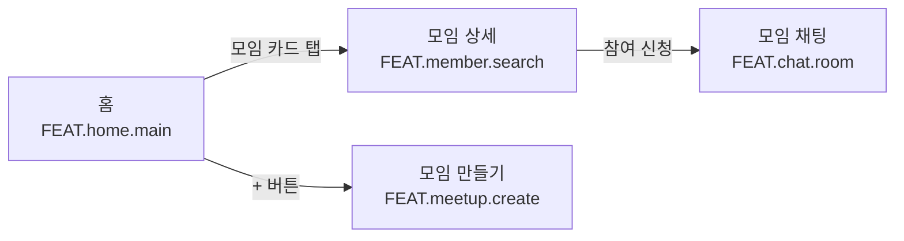
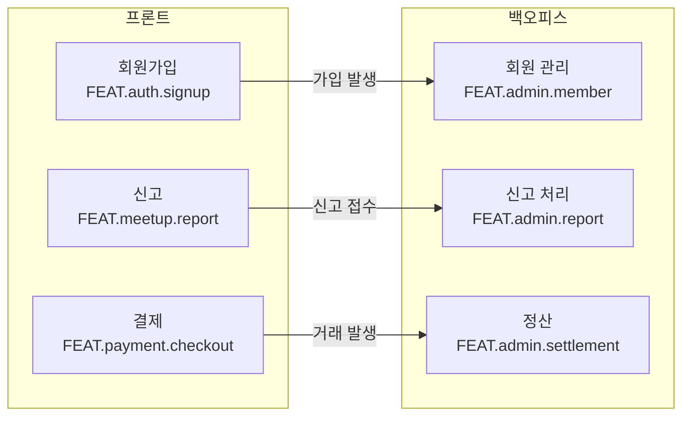

# 기능 관계도: [프로젝트 이름]

> 이 문서는 IA(화면·기능 구조) 문서에서 **도출한 관계도**입니다. 원본이자 기준(SSOT)은 IA 문서이며,
> 이 관계도는 IA가 바뀌면 언제든 다시 뽑아낼 수 있는 파생물입니다. (IA 문서는 이 작업으로 바뀌지 않습니다.)
>
> 두 가지를 그립니다: ① 화면 사이 이동(UI 흐름), ② 한 기능이 다른 기능에 일을 만드는 연동(프론트↔백오피스).
> 각 관계는 **읽기 쉬운 목록 + mermaid 그림**으로 함께 적습니다. 그림이 안 보이는 뷰어에서도 목록만으로 이해됩니다.
> 노드는 가능하면 기능 ID(`FEAT.도메인.기능명`)로 찍습니다. (IA에 ID가 없으면 이름으로 적고, 이름 충돌 주의를 표시)

## 1. UI 흐름 관계도 (화면 전이)

**관계 목록** — 무엇을 누르면 어디로 가는지.
- 홈(`FEAT.home.main`) —[모임 카드 탭]→ 모임 상세(`FEAT.member.search`)
- 모임 상세 —[참여 신청]→ 모임 채팅(`FEAT.chat.room`)
- 홈 —[+ 버튼]→ 모임 만들기(`FEAT.meetup.create`)
- …

**그림 (mermaid)**

## 2. 프론트↔백오피스 연동 관계도 (트리거)

**관계 목록** — 프론트에서 무엇이 생기면 → 관리자에서 무엇이 필요한지.
- 회원가입(`FEAT.auth.signup`) —[가입 발생]→ 회원 관리(`FEAT.admin.member`)
- 신고(`FEAT.meetup.report`) —[신고 접수]→ 신고 처리(`FEAT.admin.report`)
- 결제(`FEAT.payment.checkout`) —[거래 발생]→ 정산(`FEAT.admin.settlement`)
- …

**그림 (mermaid)**

---

## 가정
IA 문서에 없어서 추론한 연결. 확인하고 고치면 됩니다.
- …

## 참고
- 데이터가 어디에 저장되고 흐르는지(데이터 흐름도)는 여기에 없습니다 — 데이터 모델 문서가 있어야 그릴 수 있습니다.
- IA에 기능 ID(`FEAT.…`)가 없어 이름으로 표기한 노드가 있으면 여기에 표시합니다.
