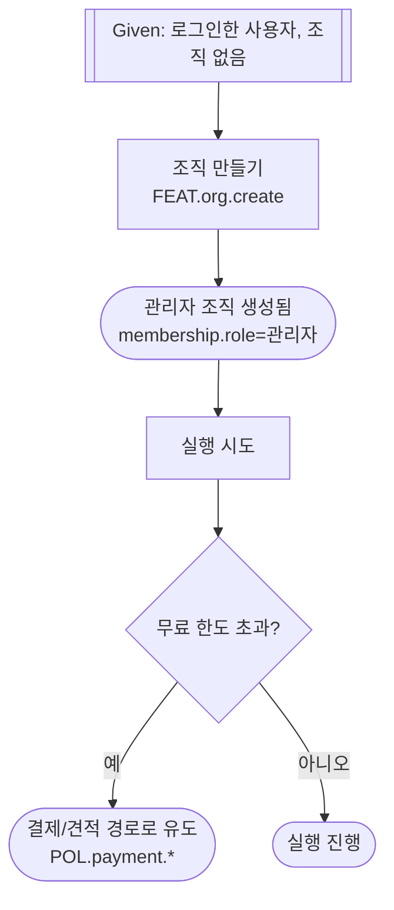

# 시나리오: [여정 이름]

> 이 문서는 사용자가 서비스에서 밟는 **하나의 여정**을 정리한 것입니다.
> 시나리오는 **결정의 원본이 아닙니다** — 화면·기능·정책의 결정은 각 원본 문서(IA·정책서·데이터 모델)에 있고,
> 여기서는 그것들을 **ID로 가리키기만** 합니다. 원본이 바뀌면 이 문서는 **다시 뽑습니다.**

- **ID**: `SCN.{도메인}.{이름}` (예: `SCN.org.onboarding`)
- **상태**: `탐색`(스케치, 폐기 가능) / `파생`(확정본에서 재도출, 읽기 전용) / `확정`(spec-kit 인수 시나리오로 승격) 중 하나
- **목적**: 이 여정이 무엇을 이루기 위한 것인지 한 줄.
- **행위자**: 누가 수행하는가 (예: 로그인 사용자, 관리자).
- **선행조건**: 이 여정이 시작되기 위해 참인 상태.

---

## 흐름

> **스케치 단계(상태: 탐색)** 라면 아래를 **자연어 문장**으로 편하게 씁니다. Given/When/Then을 강요하지 않습니다.
> **파생·승격 단계(상태: 파생/확정)** 라면 아래처럼 **Given/When/Then + 스텝별 추적 링크**로 정형화합니다.

`## SCN.org.onboarding` 예시 (상태: 파생)

- **Given** 로그인한 사용자가 아직 조직이 없다 &nbsp; → 회원가입(`FEAT.auth.signup`) · 계정유형(`account.type`)
- **When** "조직 만들기"를 한다 &nbsp; → 조직 만들기(`FEAT.org.create`) · 조직(`organization`) · 멤버 역할(`membership.role`)
- **Then** 본인이 관리자인 조직이 생성된다 &nbsp; → 멤버 역할(`membership.role`)
- **When** 무료 한도를 넘겨 실행을 시도한다 &nbsp; → 사용량(`FEAT.billing.usage`) · 결제 정책(`POL.payment.charge`)
- **Then** 결제/견적 경로로 유도된다 &nbsp; → 결제(`FEAT.billing.checkout`) · 결제 정책(`POL.payment.*`)

각 스텝(Given/When/Then)마다:
- 왼쪽은 **사람이 읽는 흐름 한 문장**.
- 오른쪽은 그 스텝이 닿는 것을 **`이름(ID)` 형태로** — 기능 `이름(FEAT.*)`, 데이터 `이름(그룹.필드)`, 정책 `이름(POL.*)`, 유스케이스 `이름(UC.*)`.
  **규칙·정의 내용(정책 수치 등)을 문장에 베끼지 않는다** — 값은 원본에 있고 여기선 가리키기만 한다.
- `이름(ID)` 표기는 **새로 만들거나 수정하는 문서에만** 적용한다(기존 문서가 이 형식이 아니어도 틀린 게 아니다).
- 대안·예외 흐름이 있으면 하위에 `- (대안)` / `- (예외)`로 이어 쓴다.

---

## 한눈에 보기 (mermaid flowchart)

> GWT 스텝을 사람이 한눈에 보도록 그린 **파생 뷰**입니다. 원본은 위의 GWT 텍스트이며, 스텝이 바뀌면 이 그림도 다시 그립니다.
> When=행동 노드, Then=결과 노드, 대안·예외=분기로 표현합니다.



## 추적표

이 시나리오가 닿는 ID를 종류별로 모은다. **검증(정합·추적 점검)이 이 표를 본다.**

| 종류 | 참조 `이름(ID)` | 원본 문서(가리키기만) |
|---|---|---|
| 기능 | 조직 만들기(`FEAT.org.create`), 결제(`FEAT.billing.checkout`) | IA / 화면 설계서 |
| 데이터 | 조직(`organization`), 멤버 역할(`membership.role`), 계정유형(`account.type`) | 데이터 모델 |
| 정책 | 결제 정책(`POL.payment.charge`) | 정책서 |
| 유스케이스 | 조직 만들기(`UC.org.create`) | supporting/use-cases.md |

### (기계 표현) 추적 미러

위 추적표를 **소프트웨어가 읽는 사본**으로 옮긴 것입니다. 위 표(사람용)가 원본이고, 스텝·참조가 바뀌면 이 블록도 다시 만듭니다. `kind`는 참조 종류(어느 원본에서 조회할지)이고 `id`는 대상입니다.

```json scenario.trace
{
  "scenarios": [
    {
      "id": "SCN.org.onboarding",
      "label": "조직 온보딩",
      "status": "derived",
      "refs": [
        { "kind": "feat",    "id": "FEAT.org.create" },
        { "kind": "feat",    "id": "FEAT.billing.checkout" },
        { "kind": "data",    "id": "organization" },
        { "kind": "data",    "id": "membership.role" },
        { "kind": "policy",  "id": "POL.payment.charge" },
        { "kind": "usecase", "id": "UC.org.create" }
      ]
    }
  ]
}
```

### 이 블록으로 소프트웨어가 자동 점검할 수 있는 것

이 미러는 사람이 아니라 소프트웨어가 읽는 사본이라, 아래를 자동으로 확인할 수 있습니다(직접 하실 일은 아니고, 참고용입니다).

- **형식 검증** — `id`가 `SCN.<도메인>.<이름>` 꼴인지, `status`·`kind` 값이 정해진 목록에 맞는지.
- **추적표 ↔ 미러 정합** — 위 사람용 표의 참조와 이 블록의 참조가 서로 어긋나지 않는지.
- **끊긴 링크(죽은 링크)** — `refs`가 가리키는 기능·데이터·정책·유스케이스가 **실제 원본 문서에 있는지**(`kind`로 어느 등기부를 볼지 정해 자동 조회). 이 스킬 S4 "링크 존재 검사"를 기계가 대신한다.

## 원본 링크

각 결정이 사는 SSOT 문서 위치. 베끼지 않고 **가리키기만** 한다.
- 기능·화면 구조 → (IA 문서 경로/앵커)
- 정책 규칙 → (정책서 경로/`POL.*`)
- 데이터 정의 → (데이터 모델 경로/`그룹.필드`)

## 이관 필요 (스케치 단계에서만)

스케치 중 새로 정해졌지만 **아직 원본 문서에 없는 결정**을 여기 모아, 해당 스킬로 넘긴다. (결정 이관 규칙)
- [ ] (예) "무료 한도 초과 시 결제 유도" → 정책서에 `POL.payment.*`로 추가 필요
- 이 목록이 비워져야(= 전부 이관돼야) 시나리오를 `확정`으로 부를 수 있다.
