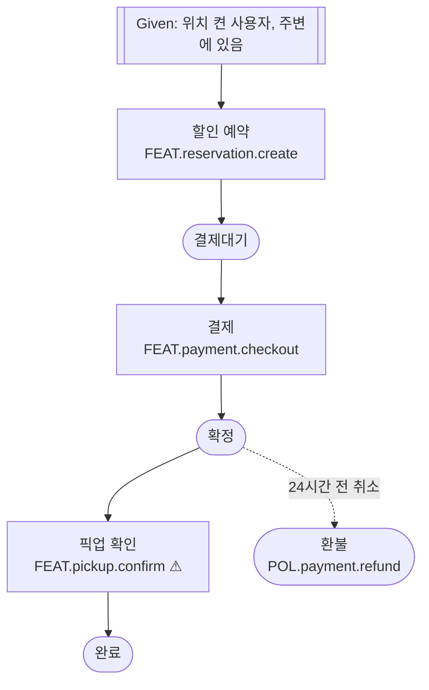

# 예시 워크스루 — 시나리오 작성 + 게이트키퍼

이 문서는 `easyproduct-scenario`가 실제로 무엇을 만들고, **게이트키퍼로서 결함을 어떻게 짚는지**를 보여주는
**작성 예시(참고 패턴)**다. 시나리오를 쓸 때 이 형식·톤을 따른다. (예시라 특정 서비스 값이 들어 있다 — 실제 작업에선 해당 서비스 값으로 바꾼다.)

예시 서비스: **동네 마감 할인 픽업 앱**(README의 예시 서비스).

---

## 1. 재료 (원본 문서에서 도출한 것)

시나리오는 결정을 새로 만들지 않는다. 아래는 **이미 다른 문서에 있는** ID들이다.

- **기획서 핵심 행동(3개)**: ① 주변 할인 둘러보기 ② 예약·결제 ③ 픽업 확인
- **IA 기능**: `FEAT.deal.browse`, `FEAT.reservation.create`, `FEAT.payment.checkout`
  *(주의: 핵심 행동 ③ "픽업 확인"에 대응하는 기능이 IA에 아직 없다 — 아래 게이트키퍼가 이걸 잡는다)*
- **정책**: `POL.payment.refund`, `POL.noshow.cancel`("예약 24시간 전까지 취소 가능")
- **데이터**: `deal`, `reservation.status`, `user.location`

여정은 판단으로 고르지 않고 **핵심 행동 3개에서 도출**한다 → 여정 하나가 ①②③을 관통한다.

---

## 2. 작성된 시나리오 (파생 단계 — `supporting/scenarios/scenario-deal-reservePickup.md`)

```
## SCN.deal.reservePickup  [상태: 파생]
- 목적: 주변 마감 할인을 예약·결제하고 매장에서 픽업
- 행위자: 로그인 사용자 / 선행조건: 위치 권한 허용

- Given 위치를 켠 사용자가 주변에 있다        → [FEAT.deal.browse] [user.location]
- When  마감 할인 상품을 예약한다              → [FEAT.reservation.create] [reservation.status]
- Then  예약이 "결제대기"로 잡힌다             → [reservation.status=결제대기]
- When  결제한다                               → [FEAT.payment.checkout] [POL.payment.refund]
- Then  예약이 "확정"이 된다                    → [reservation.status=확정]
- When  매장에서 픽업을 확인한다               → [FEAT.pickup.confirm]   ← IA에 없는 ID(의도적 결함)
- Then  예약이 "완료"가 된다                    → [reservation.status=완료]
- (예외) 예약 24시간 전 취소 시 환불           → [POL.noshow.cancel] [POL.payment.refund]
```

### 한눈에 보기 (mermaid — GWT의 파생 뷰)



### 추적표

| 종류 | 참조 ID | 원본 문서 |
|---|---|---|
| 기능 | `FEAT.deal.browse`, `FEAT.reservation.create`, `FEAT.payment.checkout`, `FEAT.pickup.confirm`⚠ | IA / 화면 설계서 |
| 데이터 | `user.location`, `reservation.status`, `deal` | 데이터 모델 |
| 정책 | `POL.payment.refund`, `POL.noshow.cancel` | 정책서 |

---

## 3. 검증(Step S4)이 내는 보고 — 게이트키퍼 작동 예시

이 시나리오를 `references/traceability-check.md` 절차로 점검하면 다음이 나온다:

```
■ 죽은 링크 (기계적·확실)
  - SCN.deal.reservePickup 이 [FEAT.pickup.confirm] 을 참조하는데 IA에 그 기능 ID가 없음.

■ 커버리지 (필수)
  - 기획 핵심 행동 ③ "픽업 확인"이 어떤 실재 기능 ID에도 안 닿음 → 테스트·점검 구멍 후보.

■ 설계 결함 후보 (보고 후 사용자 선택)
  - 여정은 "픽업 확인" 단계를 요구하는데 IA·화면설계에 픽업 확인 기능/화면이 없다.
  - 방향은 단정하지 않음:
      (a) IA에 픽업 확인 기능이 빠졌다   → 회귀 후보: IA/화면 설계
      (b) 시나리오가 과한 단계를 그렸다  → 시나리오만 수정
  - 제시: "픽업 확인 기능을 IA에 추가하러 돌아갈까요, 아니면 이 단계를 빼고 시나리오만 맞출까요?"
    → 되돌릴지는 사용자가 결정한다. 자동으로 재설계하지 않는다.

■ 의미 불일치 (확신 시만)
  - 시나리오 예외 "24시간 전 취소 시 환불" ↔ POL.noshow.cancel "24시간" → 일치. 보고 없음.
```

핵심: **죽은 링크·커버리지 누락은 확실히 잡고**, **설계 결함은 회귀 후보와 함께 제시하되 결정은 사용자에게** 맡긴다.
시나리오는 SSOT가 아니므로 스스로 IA를 고치지 않는다.

---

## 4. 사용자가 "IA에 픽업 기능 추가"를 택하면

1. `easyproduct-ia-designer` 재진입으로 `FEAT.pickup.confirm`(및 대응 화면)을 IA에 추가한다(그 스킬이 IA의 SSOT).
2. IA가 고쳐지면 이 시나리오를 **재도출**한다 — `[FEAT.pickup.confirm]`이 이제 실재하므로 죽은 링크·커버리지 경고가 사라진다.
3. 링크-온리 원칙 덕에 재도출 비용은 낮다(스텝 흐름·링크만 다시 맞춤).

> 이 예시는 "화면 설계 후(뒤 게이트)"에 결함을 잡은 경우다. 같은 결함을 **화면을 짓기 전(Stage 1.5 앞 게이트, 스케치)**에
> 잡았다면 IA만 고치면 되어 되돌리는 비용이 더 작다 — 그래서 흐름이 복잡한 서비스는 앞 게이트를 권한다.
